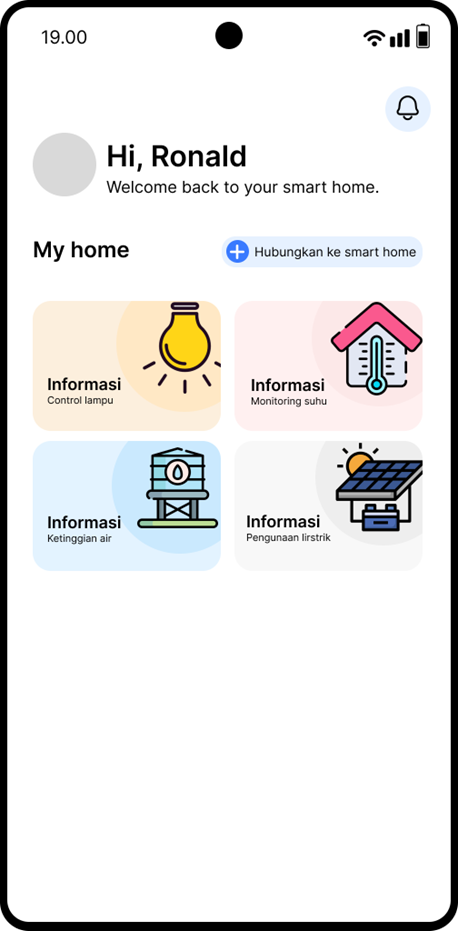
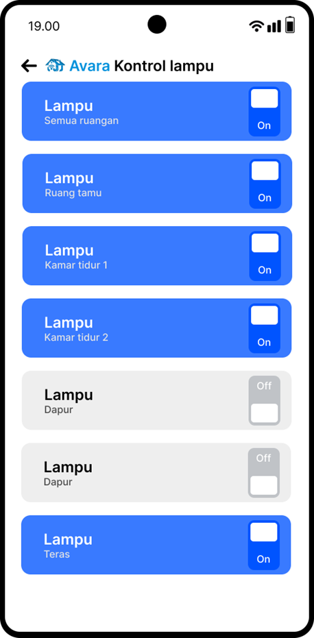
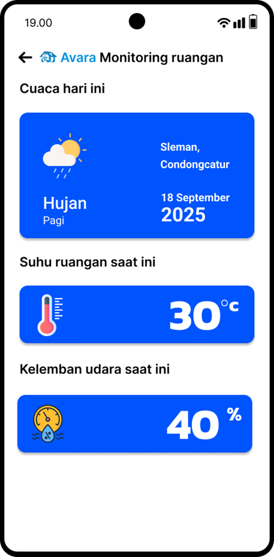
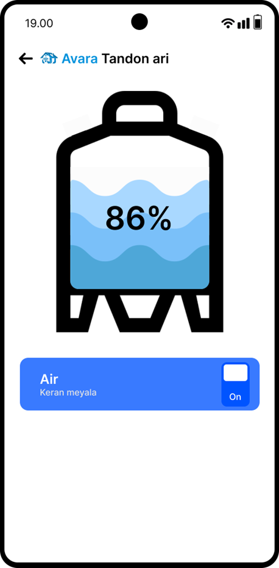
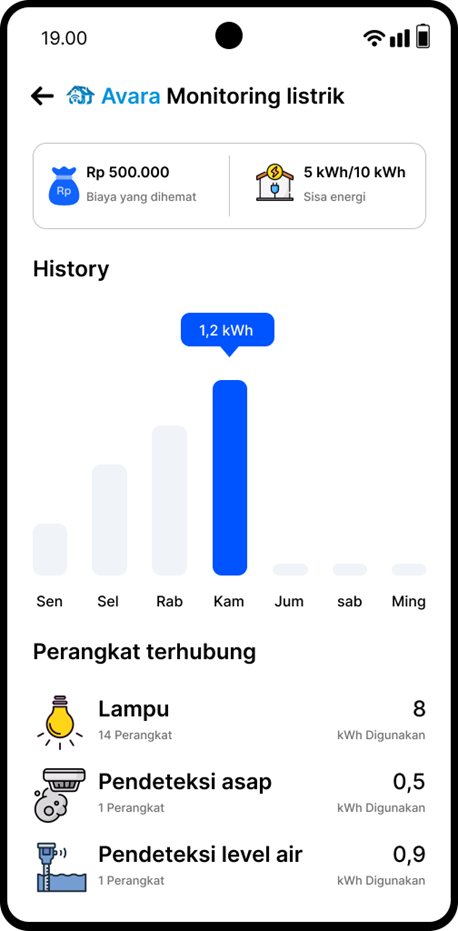
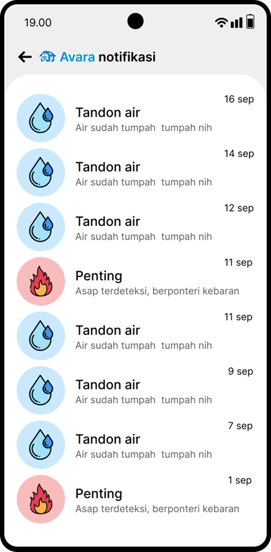

# Semantik SmartHome

Semantik SmartHome adalah aplikasi **IoT (Internet of Things)** untuk mengelola dan memonitor **rumah pintar berbasis solar panel**. Aplikasi ini dirancang agar pengguna dapat mengontrol perangkat rumah secara efisien, memantau kondisi lingkungan secara real-time, dan menerima notifikasi keamanan secara otomatis.

Aplikasi ini mendukung berbagai sensor dan modul IoT seperti relay, sensor suhu, sensor level air, alarm kebakaran, serta integrasi data penggunaan listrik dari panel surya.

---

## ✨ Fitur Utama

### 🔆 1. Kontrol Lampu

Menghidupkan dan mematikan lampu secara jarak jauh melalui aplikasi.
Mendukung mode otomatis berdasarkan jadwal atau sensor cahaya.

### 💧 2. Monitoring Tandon Air

Menampilkan level/ketinggian air secara real-time.
Peringatan ketika tandon hampir kosong atau hampir penuh.

### ⚡ 3. Monitoring Penggunaan Listrik

Memantau konsumsi listrik harian, mingguan, dan bulanan.
Terintegrasi dengan sistem solar panel untuk menampilkan:

* Total energi yang dihasilkan
* Energi yang digunakan
* Sisa kapasitas baterai (jika tersedia)

### 🌡️ 4. Monitoring Suhu Ruangan

Menampilkan grafik suhu ruangan real-time.
Batas aman suhu dan notifikasi jika suhu melebihi ambang.

### 🔥 5. Notifikasi Alarm Kebakaran

Sensor asap/nyala mendeteksi potensi kebakaran.
Aplikasi akan mengirim notifikasi darurat (push/SMTP/SMS sesuai konfigurasi).

---

## 📱 Tampilan Aplikasi

| Home                    | Kontrol Lampu                  | Monitoring Suhu                  |
| ------------------------------- | ------------------------------- | ------------------------------- |
|  |  |  |

| Monitoring Tandon                   | Monitoring Listrik                      | Notifikasi                       |
| ------------------------------- | ------------------------------- | ------------------------------- |
|  |  |  |

---
