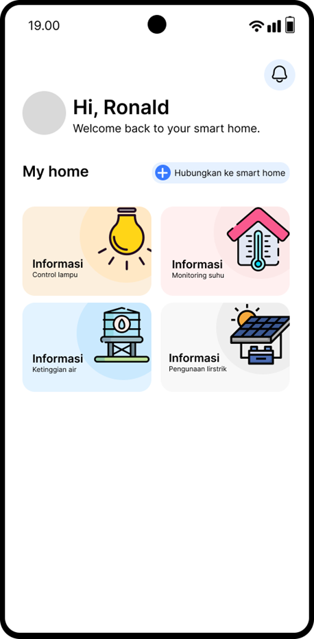
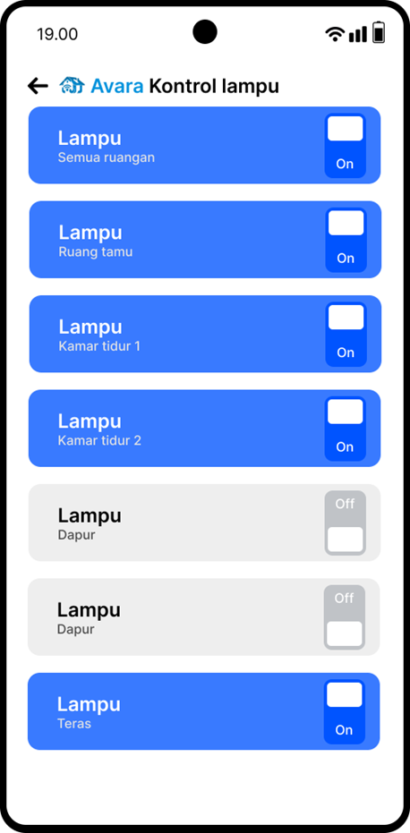
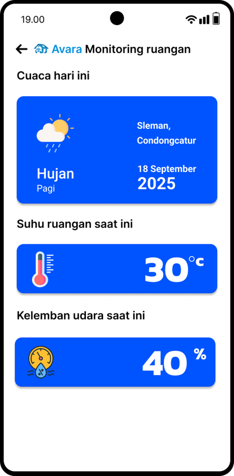
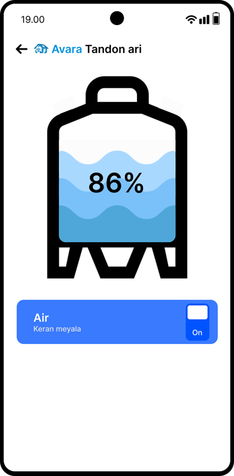
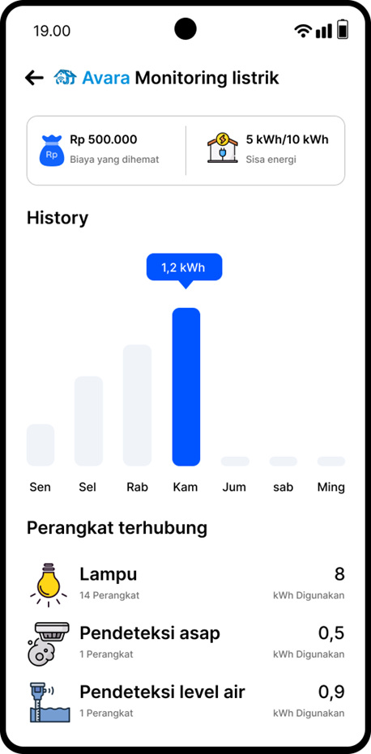
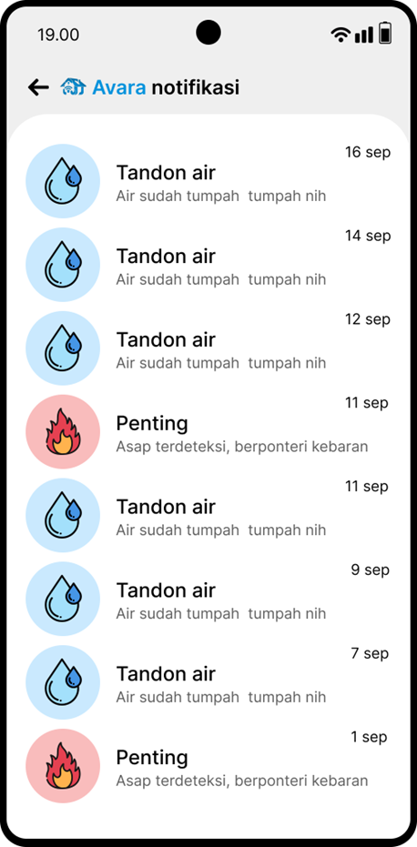

# Semantik SmartHome

Dokumentasi Lengkap Aplikasi Smart Home IoT Berbasis Android

## Daftar Isi

1. [Gambaran Umum](#gambaran-umum)
2. [Fitur Aplikasi](#fitur-aplikasi)
3. [Arsitektur Sistem](#arsitektur-sistem)
4. [Teknologi yang Digunakan](#teknologi-yang-digunakan)
5. [Struktur Project](#struktur-project)
6. [Instalasi dan Konfigurasi](#instalasi-dan-konfigurasi)
7. [Panduan Penggunaan](#panduan-penggunaan)
8. [Integrasi Firebase](#integrasi-firebase)
9. [Komponen Utama](#komponen-utama)
10. [Screenshot Aplikasi](#screenshot-aplikasi)
11. [Troubleshooting](#troubleshooting)
12. [Kontribusi](#kontribusi)
13. [Lisensi](#lisensi)

---

## Gambaran Umum

**Semantik SmartHome** adalah aplikasi Android berbasis IoT (Internet of Things) yang dirancang untuk mengelola dan memonitor rumah pintar yang menggunakan panel surya sebagai sumber energi utama. Aplikasi ini memungkinkan pengguna untuk:

- Mengontrol perangkat rumah secara remote
- Memantau kondisi lingkungan secara real-time
- Menerima notifikasi keamanan otomatis
- Mengelola penggunaan energi berbasis solar panel

Aplikasi ini dibangun dengan bahasa **Kotlin 100%** dan terintegrasi penuh dengan **Firebase Realtime Database**, **Firebase Cloud Messaging (FCM)**, dan **Firestore** untuk menyimpan riwayat penggunaan listrik.

---

## Fitur Aplikasi

### 1. Kontrol Lampu

Fitur untuk mengontrol lampu di berbagai ruangan secara remote:

- Menghidupkan/mematikan lampu individual per ruangan (5 lampu)
- Mode "Semua Ruangan" untuk kontrol semua lampu sekaligus
- Sinkronisasi status real-time dengan Firebase Realtime Database
- Animasi transisi yang smooth pada perubahan status
- Penyimpanan status lokal menggunakan SharedPreferences

**Implementasi Teknis:**
- Activity: `ControlLampuActivity.kt`
- Firebase Path: `IoTSystem/Lampu/Lampu1-5`
- Status: `ON` / `OFF`

### 2. Monitoring Tandon Air

Memantau level air di tandon secara real-time dengan visualisasi yang intuitif:

- Menampilkan tinggi air dalam satuan sentimeter (cm)
- Visualisasi grafis dengan animasi perubahan level air
- Kontrol pompa air (ON/OFF)
- Peringatan otomatis saat tandon hampir kosong atau penuh
- Perhitungan persentase volume air

**Implementasi Teknis:**
- Activity: `MonitoringTandonAirActivity.kt`
- Firebase Path: `IoTSystem/TandonAir`
- Data: `tinggiAir_cm`, `pompa`
- Range: 0-50 cm dengan max height 200dp

### 3. Monitoring Penggunaan Listrik

Memantau konsumsi listrik dengan integrasi data panel surya:

- Grafik penggunaan listrik mingguan (bar chart)
- Data harian, mingguan, dan bulanan
- Informasi biaya listrik harian dalam Rupiah
- Total energi yang dihasilkan panel surya
- Energi yang digunakan dan sisa kapasitas
- Auto-refresh setiap 3 detik
- Date picker untuk melihat riwayat bulan tertentu

**Implementasi Teknis:**
- Activity: `MonitoringListrikActivity.kt`
- Database: Firebase Firestore
- Collection: `EnergyUsageDaily` dan `EnergyUsageMonthly`
- Model: `ElectricityHistoryModel.kt`, `MonthlyElectricityHistoryModel.kt`
- Fitur: Anonymous authentication, data caching

### 4. Monitoring Suhu dan Kelembaban Ruangan

Menampilkan kondisi lingkungan secara real-time:

- Suhu ruangan dalam Celsius
- Kelembaban udara dalam persentase
- Status kondisi ruangan (Normal/Tidak Normal)
- Update otomatis dari sensor IoT
- UI yang mudah dibaca dengan ikon visual

**Implementasi Teknis:**
- Activity: `MonitoringRuanganActivity.kt`
- Firebase Path: `IoTSystem/Lingkungan`
- Data: `suhu`, `kelembapan`, `status`

### 5. Sistem Notifikasi Alarm Kebakaran

Sistem notifikasi darurat untuk deteksi kebakaran:

- Deteksi asap/nyala api oleh sensor
- Push notification menggunakan Firebase Cloud Messaging (FCM)
- Notifikasi persistent dengan suara dan getaran
- Penyimpanan riwayat notifikasi lokal
- Badge counter untuk notifikasi yang belum dibaca
- Support Android 13+ notification permission

**Implementasi Teknis:**
- Service: `AppFirebaseMessagingService.kt`
- Helper: `NotificationHelper.kt`
- Database: `NotificationDatabase.kt` (SharedPreferences)
- Model: `NotificationModel.kt`
- Channel ID: `iot_alerts`

---

## Arsitektur Sistem

### Diagram Arsitektur

```
┌─────────────────┐
│  Android App    │
│  (Kotlin)       │
└────────┬────────┘
         │
         ├──────────────────┐
         │                  │
         ▼                  ▼
┌─────────────────┐  ┌─────────────────┐
│ Firebase        │  │ Firebase        │
│ Realtime DB     │  │ Firestore       │
│ (Sensor Data)   │  │ (History Data)  │
└────────┬────────┘  └─────────────────┘
         │
         ▼
┌─────────────────┐
│ Firebase Cloud  │
│ Messaging (FCM) │
│ (Notifications) │
└─────────────────┘
         │
         ▼
┌─────────────────┐
│ IoT Devices     │
│ (ESP32/Arduino) │
│ - Sensors       │
│ - Relays        │
│ - Solar Panel   │
└─────────────────┘
```

### Komponen Sistem

1. **Presentation Layer (Activities)**
   - SpriteScreenActivity (Splash Screen)
   - HomeActivity (Dashboard)
   - ControlLampuActivity
   - MonitoringTandonAirActivity
   - MonitoringRuanganActivity
   - MonitoringListrikActivity
   - NotificationActivity

2. **Data Layer**
   - Firebase Realtime Database (real-time sensor data)
   - Firebase Firestore (historical electricity data)
   - SharedPreferences (local caching)

3. **Services**
   - AppFirebaseMessagingService (FCM handler)
   - NotificationHelper (notification management)

4. **Models**
   - NotificationModel
   - ElectricityHistoryModel
   - MonthlyElectricityHistoryModel

---

## Teknologi yang Digunakan

### Platform dan Bahasa

- **Platform:** Android
- **Bahasa:** Kotlin 100%
- **Min SDK:** 24 (Android 7.0)
- **Target SDK:** 35 (Android 15)
- **Compile SDK:** 35
- **Java Version:** 11

### Dependencies Utama

```kotlin
// Android Core
implementation("androidx.core:core-ktx")
implementation("androidx.appcompat:appcompat")
implementation("com.google.android.material:material")
implementation("androidx.activity:activity")
implementation("androidx.constraintlayout:constraintlayout")

// Firebase
implementation("com.google.firebase:firebase-database")
implementation("com.google.firebase:firebase-firestore")
implementation("com.google.firebase:firebase-messaging")
implementation("com.google.firebase:firebase-auth")

// UI Components
implementation("de.hdodenhof:circleimageview:3.1.0")
implementation("androidx.recyclerview:recyclerview:1.3.1")
implementation("androidx.cardview:cardview:1.0.0")

// Other
implementation("androidx.fragment:fragment-ktx:1.6.1")
implementation("androidx.lifecycle:lifecycle-runtime-ktx:2.7.0")
implementation("com.google.code.gson:gson:2.10.1")
```

### Build System

- **Gradle:** Kotlin DSL
- **Build Tools:** Android Gradle Plugin
- **View Binding:** Enabled

---

## Struktur Project

```
smartHome/
├── app/
│   ├── src/
│   │   ├── main/
│   │   │   ├── java/com/example/smarthome/
│   │   │   │   ├── model/
│   │   │   │   │   ├── NotificationModel.kt
│   │   │   │   │   ├── ElectricityHistoryModel.kt
│   │   │   │   │   └── MonthlyElectricityHistoryModel.kt
│   │   │   │   ├── SpriteScreenActivity.kt
│   │   │   │   ├── MainActivity.kt
│   │   │   │   ├── HomeActivity.kt
│   │   │   │   ├── ControlLampuActivity.kt
│   │   │   │   ├── MonitoringTandonAirActivity.kt
│   │   │   │   ├── MonitoringRuanganActivity.kt
│   │   │   │   ├── MonitoringListrikActivity.kt
│   │   │   │   ├── NotificationActivity.kt
│   │   │   │   ├── NotificationAdapter.kt
│   │   │   │   ├── NotificationDatabase.kt
│   │   │   │   ├── NotificationHelper.kt
│   │   │   │   └── AppFirebaseMessagingService.kt
│   │   │   ├── res/
│   │   │   │   ├── layout/
│   │   │   │   ├── drawable/
│   │   │   │   ├── values/
│   │   │   │   └── xml/
│   │   │   └── AndroidManifest.xml
│   │   └── test/
│   └── build.gradle.kts
├── gradle/
├── build.gradle.kts
├── settings.gradle.kts
├── gradle.properties
├── Picture1.png - Picture7.png
└── README.md
```

---

## Instalasi dan Konfigurasi

### Prasyarat

- Android Studio Hedgehog | 2023.1.1 atau lebih baru
- JDK 11 atau lebih tinggi
- Android SDK dengan API Level 24-35
- Akun Firebase dengan project yang sudah dikonfigurasi
- Perangkat Android atau Emulator dengan min SDK 24

### Langkah-langkah Instalasi

#### 1. Clone Repository

```bash
git clone https://github.com/nuhgroh2004/smartHome.git
cd smartHome
```

#### 2. Konfigurasi Firebase

a. Buat project baru di [Firebase Console](https://console.firebase.google.com/)

b. Tambahkan aplikasi Android dengan package name: `com.example.smarthome`

c. Download file `google-services.json`

d. Letakkan file tersebut di direktori `app/`

e. Aktifkan layanan Firebase berikut:
   - Realtime Database
   - Cloud Firestore
   - Cloud Messaging
   - Authentication (Anonymous)

#### 3. Struktur Firebase Realtime Database

Buat struktur database sebagai berikut:

```json
{
  "IoTSystem": {
    "Lampu": {
      "Lampu1": "OFF",
      "Lampu2": "OFF",
      "Lampu3": "OFF",
      "Lampu4": "OFF",
      "Lampu5": "OFF"
    },
    "TandonAir": {
      "tinggiAir_cm": 0,
      "pompa": "OFF"
    },
    "Lingkungan": {
      "suhu": 25,
      "kelembapan": 60,
      "status": "NORMAL"
    },
    "FCMTokens": {}
  }
}
```

#### 4. Struktur Cloud Firestore

Buat collections berikut:

**Collection: `EnergyUsageDaily`**
```
{
  "biayaHarian_Rp": 0,
  "date": "2026-01-26",
  "day": 26,
  "dayaTerakhir_W": 0,
  "firstRecordedAt": Timestamp,
  "jumlahPembacaan": 0,
  "lastPembacaanAt": Timestamp,
  "lastUpdatedAt": Timestamp,
  "month": 1,
  "rataRata_W": 0,
  "totalDaya_Wh": 0,
  "totalDaya_kWh": 0,
  "year": 2026
}
```

**Collection: `EnergyUsageMonthly`**
```
{
  "biayaBulanan_Rp": 0,
  "month": 1,
  "totalDaya_kWh": 0,
  "year": 2026
}
```

#### 5. Build dan Run

```bash
./gradlew clean
./gradlew build
```

Atau jalankan langsung dari Android Studio dengan klik tombol **Run** (Shift + F10)

---

## Panduan Penggunaan

### 1. Splash Screen

Saat aplikasi pertama kali dibuka, akan muncul splash screen dengan animasi logo yang menarik.

### 2. Home Dashboard

Dashboard utama menampilkan 4 menu utama:
- Kontrol Lampu
- Monitoring Tandon Air
- Monitoring Ruangan (Suhu & Kelembaban)
- Monitoring Listrik

Dan 1 icon notifikasi dengan badge counter di kanan atas.

### 3. Kontrol Lampu

- Tap pada card "Lampu" di dashboard
- Toggle switch untuk menghidupkan/mematikan lampu per ruangan
- Status akan tersimpan dan tersinkronisasi dengan Firebase
- Gunakan toggle "Semua Ruangan" untuk kontrol semua lampu sekaligus

### 4. Monitoring Tandon Air

- Tap pada card "Tandon Air"
- Lihat visualisasi level air dengan animasi
- Perhatikan persentase dan tinggi air dalam cm
- Toggle pompa untuk menghidupkan/mematikan pompa air

### 5. Monitoring Suhu Ruangan

- Tap pada card "Monitoring Ruangan"
- Lihat suhu dan kelembaban real-time
- Status akan berubah secara otomatis berdasarkan kondisi

### 6. Monitoring Listrik

- Tap pada card "Monitoring Listrik"
- Lihat grafik penggunaan listrik mingguan
- Tap pada bar untuk melihat detail harian
- Gunakan date picker untuk melihat data bulan lain
- Data akan auto-refresh setiap 3 detik

### 7. Notifikasi

- Icon notifikasi menampilkan badge merah jika ada notifikasi baru
- Tap icon untuk melihat daftar notifikasi
- Notifikasi akan otomatis ditandai sebagai sudah dibaca
- Support notifikasi push dari Firebase Cloud Messaging

---

## Integrasi Firebase

### Firebase Realtime Database

**Path: `/IoTSystem`**

Digunakan untuk:
- Status lampu real-time
- Data sensor tandon air
- Data suhu dan kelembaban
- Status pompa

**Cara Kerja:**
- App menggunakan `ValueEventListener` untuk mendengarkan perubahan
- Setiap perubahan dari IoT device akan langsung ter-update di app
- App juga bisa menulis data untuk mengontrol device (misalnya nyalakan lampu)

**Contoh Listener:**

```kotlin
firebase.reference.child("IoTSystem").child("Lampu")
    .addValueEventListener(object : ValueEventListener {
        override fun onDataChange(snapshot: DataSnapshot) {
            val status = snapshot.child("Lampu1").getValue(String::class.java)
            // Update UI
        }
        override fun onCancelled(error: DatabaseError) {
            // Handle error
        }
    })
```

### Firebase Firestore

**Collections:**
- `EnergyUsageDaily`: Data penggunaan listrik harian
- `EnergyUsageMonthly`: Agregasi data bulanan

**Cara Kerja:**
- Data historis disimpan dengan struktur timestamp
- Query berdasarkan year, month, day
- Mendukung caching untuk performa lebih baik

### Firebase Cloud Messaging (FCM)

**Service:** `AppFirebaseMessagingService`

**Cara Kerja:**
1. App menerima FCM token saat pertama kali install
2. Token disimpan ke Firebase Realtime Database di path `IoTSystem/FCMTokens`
3. Backend/IoT device mengirim notifikasi melalui FCM API
4. App menerima notifikasi dan menampilkannya
5. Notifikasi tersimpan lokal di SharedPreferences

**Format Notifikasi:**

```json
{
  "notification": {
    "title": "Sensor Asap",
    "body": "Asap terdeteksi berpotensi kebakaran"
  },
  "data": {
    "title": "Sensor Asap",
    "message": "Asap terdeteksi berpotensi kebakaran"
  }
}
```

---

## Komponen Utama

### 1. Activities

#### SpriteScreenActivity
- Splash screen dengan animasi logo
- Animasi bounce, rotate, dan translate
- Auto navigate ke HomeActivity setelah animasi selesai

#### HomeActivity
- Dashboard utama aplikasi
- Navigation ke semua fitur
- Badge counter untuk notifikasi
- Double-tap to exit
- Request notification permission untuk Android 13+

#### ControlLampuActivity
- Toggle switches untuk 5 lampu
- Toggle semua ruangan
- Firebase listener untuk sinkronisasi status
- SharedPreferences untuk caching status lokal

#### MonitoringTandonAirActivity
- Visualisasi level air dengan animasi
- Perhitungan persentase volume
- Kontrol pompa air
- Range tinggi air: 0-50 cm

#### MonitoringRuanganActivity
- Display suhu dalam Celsius
- Display kelembaban dalam persen
- Status kondisi ruangan

#### MonitoringListrikActivity
- Bar chart 7 hari
- Date picker untuk navigasi bulan
- Detail view saat tap bar
- Auto-refresh setiap 3 detik
- Anonymous authentication
- Data caching untuk performance

#### NotificationActivity
- RecyclerView untuk daftar notifikasi
- Icon berbeda untuk tipe notifikasi
- Timestamp dengan format Indonesia
- Mark as read otomatis
- Dummy data generator (untuk testing)

### 2. Database & Storage

#### NotificationDatabase
- Menggunakan SharedPreferences
- Serialisasi dengan Gson
- CRUD operations untuk notifikasi
- Observer pattern dengan listener
- Auto-increment ID
- Timestamp formatting dengan Locale Indonesia

#### SharedPreferences Keys
- `notification_history`: Simpan daftar notifikasi
- `last_id`: Track last notification ID
- `lamp_states`: Cache status lampu
- `water_states`: Cache status tandon air

### 3. Services

#### AppFirebaseMessagingService
- Extends FirebaseMessagingService
- Handle onNewToken untuk save FCM token
- Handle onMessageReceived untuk process notifikasi
- Save notifikasi ke local database
- Show notification dengan sound dan vibration

### 4. Helpers

#### NotificationHelper
- Create notification channel (Android O+)
- Show notification dengan custom sound
- Support ongoing notification
- Priority HIGH untuk alert
- Category ALARM

### 5. Models

#### NotificationModel
```kotlin
data class NotificationModel(
    val id: Int,
    val title: String,
    val message: String,
    val timestamp: String,
    val isRead: Boolean
)
```

#### ElectricityHistoryModel
```kotlin
data class ElectricityHistoryModel(
    val biayaHarian_Rp: Double,
    val date: String,
    val day: Int,
    val dayaTerakhir_W: Int,
    val firstRecordedAt: Timestamp?,
    val jumlahPembacaan: Int,
    val lastPembacaanAt: Timestamp?,
    val lastUpdatedAt: Timestamp?,
    val month: Int,
    val rataRata_W: Double,
    val totalDaya_Wh: Double,
    val totalDaya_kWh: Double,
    val year: Int
)
```

### 6. Adapters

#### NotificationAdapter
- RecyclerView.Adapter untuk notifikasi
- ViewHolder pattern
- Dynamic icon berdasarkan title
- Unread indicator
- Click listener

---

## Screenshot Aplikasi

### Halaman Utama



Dashboard utama dengan 4 menu fitur dan icon notifikasi.

### Kontrol Lampu



Interface untuk mengontrol lampu di berbagai ruangan dengan toggle switch.

### Monitoring Suhu



Tampilan suhu dan kelembaban ruangan secara real-time.

### Monitoring Tandon Air



Visualisasi level air tandon dengan animasi dan kontrol pompa.

### Monitoring Listrik



Grafik penggunaan listrik mingguan dengan informasi biaya.

### Notifikasi



Daftar notifikasi dengan icon dan timestamp yang informatif.

---

## Troubleshooting

### 1. Aplikasi Tidak Bisa Menerima Notifikasi

**Solusi:**
- Pastikan permission POST_NOTIFICATIONS sudah diberikan (Android 13+)
- Cek apakah notification channel sudah dibuat
- Pastikan FCM token sudah tersimpan di Firebase
- Cek log untuk error message

```kotlin
// Manually check permission
if (ContextCompat.checkSelfPermission(this, 
    Manifest.permission.POST_NOTIFICATIONS) == PackageManager.PERMISSION_GRANTED) {
    // Permission granted
}
```

### 2. Data Tidak Sinkron dengan Firebase

**Solusi:**
- Cek koneksi internet
- Pastikan Firebase configuration benar (google-services.json)
- Cek Firebase rules, pastikan allow read/write
- Enable Firebase network: `firestore.enableNetwork()`

### 3. Grafik Listrik Tidak Muncul

**Solusi:**
- Pastikan ada data di Firestore collection `EnergyUsageDaily`
- Cek anonymous authentication sudah berhasil
- Lihat log untuk error message
- Pastikan date format benar (YYYY-MM-DD)

### 4. Build Error

**Solusi:**
- Clean project: `./gradlew clean`
- Invalidate caches di Android Studio
- Sync Gradle files
- Update dependencies jika ada yang deprecated

### 5. Crash Saat Startup

**Solusi:**
- Cek logcat untuk stack trace
- Pastikan semua dependencies sudah terinstall
- Cek google-services.json ada di folder yang benar
- Pastikan min SDK sesuai (24)

---

## Fitur Security

### Firebase Rules

Pastikan mengatur Firebase Rules dengan benar:

**Realtime Database Rules:**
```json
{
  "rules": {
    "IoTSystem": {
      ".read": "auth != null",
      ".write": "auth != null"
    }
  }
}
```

**Firestore Rules:**
```javascript
rules_version = '2';
service cloud.firestore {
  match /databases/{database}/documents {
    match /EnergyUsageDaily/{document} {
      allow read, write: if request.auth != null;
    }
    match /EnergyUsageMonthly/{document} {
      allow read, write: if request.auth != null;
    }
  }
}
```

### Best Practices

1. Jangan commit `google-services.json` ke public repository
2. Gunakan environment variables untuk sensitive data
3. Implement proper error handling
4. Validate input dari Firebase
5. Gunakan ProGuard untuk release build

---

## Performance Optimization

### 1. Caching Strategy

- Gunakan SharedPreferences untuk data yang jarang berubah
- Implement memory cache untuk data listrik
- Minimize Firebase listener

### 2. Network Optimization

- Batch Firebase writes
- Use offline persistence untuk Firestore
- Implement retry mechanism dengan exponential backoff

### 3. UI Optimization

- Gunakan ViewBinding untuk performa lebih baik
- Implement RecyclerView dengan ViewHolder pattern
- Minimize layout nesting
- Use ConstraintLayout

### 4. Background Processing

- Handle Firebase listener di background thread
- Use WorkManager untuk scheduled tasks
- Implement proper lifecycle management

---

## Kontribusi

Kami menyambut kontribusi dari siapa saja. Untuk berkontribusi:

1. Fork repository ini
2. Buat branch baru (`git checkout -b feature/AmazingFeature`)
3. Commit perubahan (`git commit -m 'Add some AmazingFeature'`)
4. Push ke branch (`git push origin feature/AmazingFeature`)
5. Buat Pull Request

### Guidelines

- Follow Kotlin coding conventions
- Write meaningful commit messages
- Add comments untuk code yang kompleks
- Test semua perubahan sebelum submit PR
- Update documentation jika diperlukan

---

## Lisensi

Project ini menggunakan lisensi MIT. Lihat file `LICENSE` untuk detail lebih lanjut.

---

## Kontak

Untuk pertanyaan atau feedback, silakan hubungi:

- **Repository:** [https://github.com/nuhgroh2004/smartHome](https://github.com/nuhgroh2004/smartHome)
- **Issues:** [https://github.com/nuhgroh2004/smartHome/issues](https://github.com/nuhgroh2004/smartHome/issues)

---

## Changelog

### Version 1.0 (Current)

- Initial release
- Implementasi kontrol lampu 5 ruangan
- Monitoring tandon air dengan visualisasi
- Monitoring suhu dan kelembaban
- Monitoring listrik dengan grafik mingguan
- Sistem notifikasi FCM
- Firebase Realtime Database integration
- Cloud Firestore untuk historical data
- Anonymous authentication

---

## Roadmap

### Version 1.1 (Planned)

- Implementasi dark mode
- Widget untuk quick access
- Scheduling untuk kontrol lampu otomatis
- Export data listrik ke CSV/PDF
- Grafik penggunaan listrik bulanan dan tahunan
- Multi-language support (English)
- Voice command integration

### Version 2.0 (Future)

- AI prediction untuk penggunaan listrik
- Integration dengan Google Home / Alexa
- Remote access via cloud
- User authentication dengan multiple accounts
- Family sharing features
- Energy saving recommendations

---

## FAQ

### Q: Apakah aplikasi ini bisa bekerja tanpa internet?

A: Aplikasi memerlukan koneksi internet untuk sinkronisasi data dengan Firebase. Namun, status terakhir akan di-cache lokal menggunakan SharedPreferences.

### Q: Perangkat IoT apa saja yang didukung?

A: Aplikasi ini dirancang untuk bekerja dengan ESP32/Arduino yang terhubung ke Firebase Realtime Database. Anda perlu mengembangkan firmware IoT yang sesuai.

### Q: Bagaimana cara menambah ruangan lampu?

A: Anda perlu memodifikasi `ControlLampuActivity.kt` dan menambahkan node baru di Firebase Realtime Database pada path `IoTSystem/Lampu/LampuX`.

### Q: Apakah data listrik historis tersimpan selamanya?

A: Data tersimpan di Firestore tanpa batas waktu kecuali Anda mengimplementasikan cleanup mechanism atau mencapai quota Firestore.

### Q: Bagaimana cara mengintegrasikan dengan hardware?

A: Hardware IoT (ESP32/Arduino) harus:
1. Terhubung ke WiFi
2. Terhubung ke Firebase Realtime Database
3. Membaca/menulis data ke path yang sama dengan aplikasi
4. Mengirim notifikasi via FCM API (untuk alarm)

---

## Acknowledgments

- Firebase team untuk platform yang powerful
- Android Jetpack team untuk library yang helpful
- Open source community untuk berbagai dependencies yang digunakan

---

**Built with Love using Kotlin**

Copyright 2026 Semantik SmartHome Team
